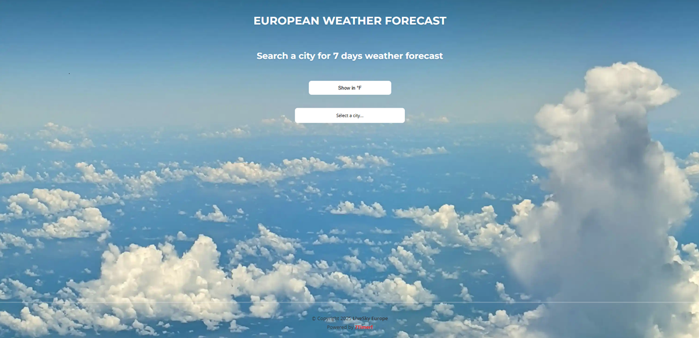
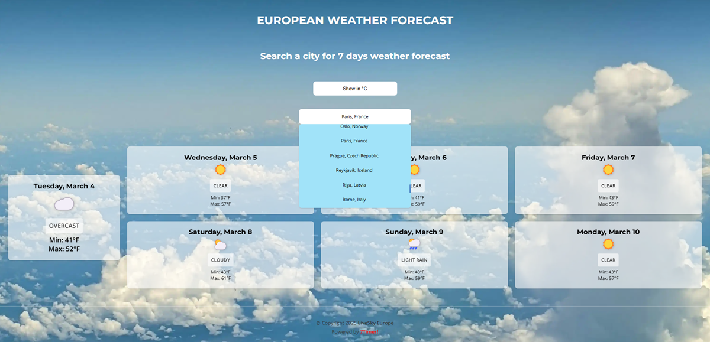
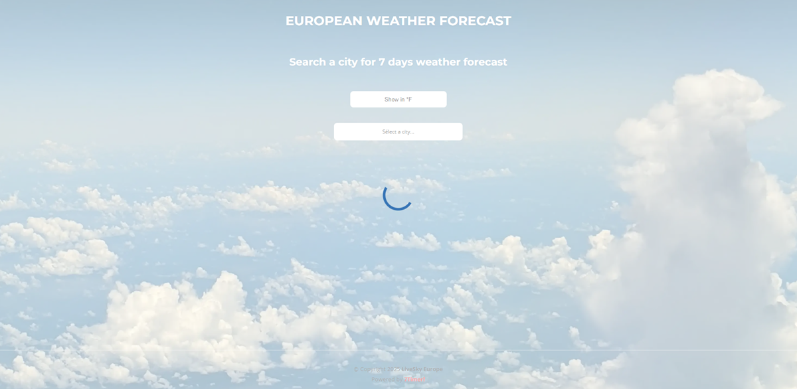
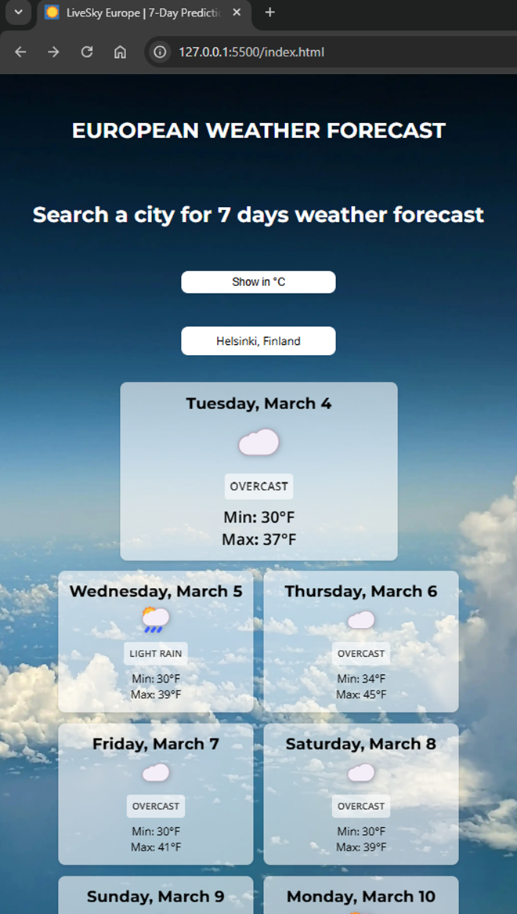
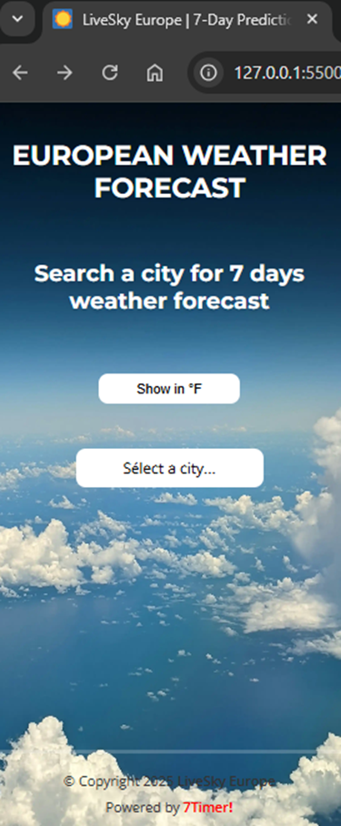
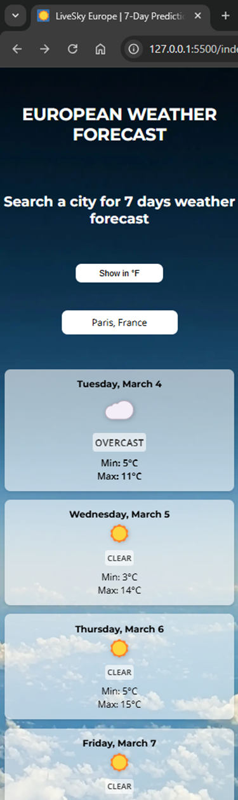
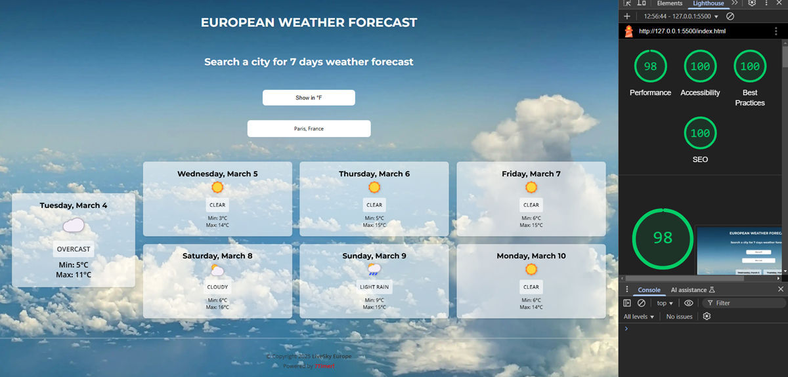

# European Weather Forecast

A 7-day weather forecast application for major European cities built with vanilla JavaScript.

## Features

- Weather forecasts for major European cities
- Temperature display in both Celsius and Fahrenheit
- Local storage for user preferences
- Responsive design for mobile and desktop
- Background image changes based on current weather

## Technologies Used

- HTML5 with semantic markup
- CSS3 with responsive design
- Vanilla JavaScript (No frameworks)
- Mocha & Chai for unit testing
- 7Timer API for weather data

## Project Structure

- `/css` - Stylesheet files
- `/js` - JavaScript application code
- `/test` - Test files using Mocha and Chai
- `/assets` - Images and favicons

## Getting Started

1. Clone the repository
2. Open `index.html` in your browser
3. Select a city from the dropdown to view weather forecast

## Testing

Run tests with:

```bash
npm test
```

## Screenshots

### Main Weather Forecast



### City Selection



### Loading Screen



### Responsive Design





### Performance



## License

This project is licensed under the MIT License - see the [LICENSE](LICENSE) file for details.

## Author

Constantin D - [GitHub Profile](https://github.com/Constantin-D)
